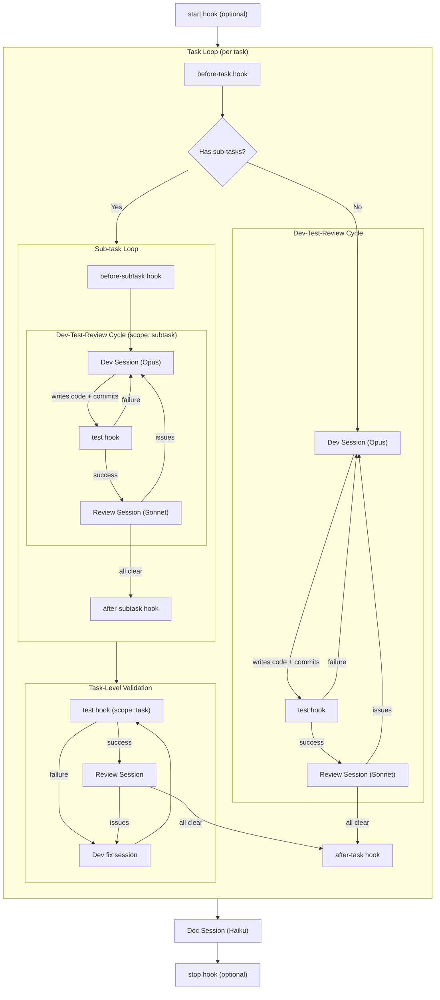

# Molcajete.ai

A CLI that turns spec-driven plans into working, tested software — powered by BDD as the done signal.

## How It Works

Molcajete is split into two packages:

[**MolcajeteAI/plugin**](https://github.com/MolcajeteAI/plugin) is a Claude Code plugin that handles **Spec** and **Plan**. It reads your intent, produces structured specs (features with EARS requirements, use cases, and Gherkin scenarios), and decomposes use cases into implementation plans. Everything lands in a `prd/` folder that becomes the permanent source of truth. The plugin generates all spec files (PRD, Gherkin). The CLI consumes those specs during build.

There is also a **reverse** path: point the plugin at an existing codebase and it will extract specs from the code, then wire BDD tests to what already exists.

**@molcajeteai/cli** (this package) handles **Setup** and **Build**. Setup detects your project's tooling and generates typed hook scripts. Build picks up a plan and dispatches tasks sequentially from your repository. Each task runs a dev → test → review cycle: a Claude Opus agent writes code and commits, a developer-defined test hook runs all programmatic checks, and a Claude Sonnet agent reviews for correctness and completeness. The loop continues until all scenarios pass.

All sessions run headlessly via `claude -p` — no user interaction during execution. The orchestrator drives everything.

```bash
molcajete setup                    # detect tooling, generate hooks
molcajete build <plan-timestamp>   # execute a plan
```

## Prerequisites

- Node.js >= 20
- [Claude Code](https://docs.anthropic.com/en/docs/claude-code) installed and authenticated

## Installation

```bash
pnpm add -g molcajete
```

Or install from source:

```bash
git clone <repo-url>
cd molcajete-v3
pnpm install
pnpm build
pnpm link --global
```

## Building from Source

```bash
pnpm install          # install dependencies
pnpm build            # produces dist/molcajete.mjs
pnpm typecheck        # type-check without emitting
pnpm dev              # watch mode (rebuilds on change)
```

The build uses [tsup](https://tsup.egoist.dev/) to bundle `src/cli.ts` into a single ESM file at `dist/molcajete.mjs` with a Node shebang.

## CLI Reference

```
molcajete [--debug] <command>
```

The `--debug` flag prints spawned Claude commands to stderr.

### `molcajete setup`

Detect project tooling and generate typed TypeScript hook scripts in `.molcajete/hooks/`.

```
molcajete setup                # detect and generate hooks
molcajete setup --overwrite    # regenerate existing hooks
molcajete setup --all          # include lifecycle hooks (before-task, after-commit, etc.)
```

| Flag | Description |
|------|-------------|
| `--overwrite` | Overwrite existing hook files |
| `--all` | Generate all hooks including lifecycle events |

### `molcajete build`

Execute all pending tasks in a plan.

```
molcajete build 202604021530-login    # by plan directory name
molcajete build --resume 202604021530-login   # skip already-implemented tasks
```

| Flag | Description |
|------|-------------|
| `--resume` | Resume from where a previous build left off |

## Plugin Commands

Inside a Claude Code session, all commands are prefixed with `/m:`.

### Spec Authoring

| Command | Description |
|---------|-------------|
| `feature` | Create a new feature with EARS requirements via creation interview |
| `usecase` | Create a new use case with flat scenario structure via creation interview |
| `scenario` | Generate Gherkin feature files from a use case |
| `spec` | Create or update features, use cases, and scenarios from free-form natural language |

### Updates

| Command | Description |
|---------|-------------|
| `update-feature` | Update an existing feature's requirements or architecture |
| `update-usecase` | Update an existing use case and propagate changes to Gherkin |
| `update-scenario` | Update an existing scenario within a use case and propagate changes to Gherkin |

### Reverse Engineering

| Command | Description |
|---------|-------------|
| `reverse-spec` | Reverse-engineer specs from existing code (broadest scope, multi-feature) |
| `reverse-feature` | Reverse-engineer a single feature from existing code (cascades to UCs + scenarios) |
| `reverse-usecase` | Reverse-engineer a use case from existing code (cascades to scenarios) |
| `reverse-scenario` | Reverse-engineer a single scenario from a code path (atomic, with Gherkin generation) |

### Planning

| Command | Description |
|---------|-------------|
| `plan` | Generate an implementation plan from specified use cases |
| `reverse-plan` | Generate a plan for wiring BDD to existing code (reverse path) |

### Building

| Command | Description |
|---------|-------------|
| `build` | Execute an implementation plan — dispatches tasks until all BDD tests pass |

### Research

| Command | Description |
|---------|-------------|
| `research` | Deep research with tech stack context, parallel agents, and long-form output |

The CLI's build commands (`develop`, `validate`, `document`) are invoked headlessly by the orchestrator via `claude -p` — they are not user-facing plugin commands.

## Build Flow



### Sub-task Flow

When a task has sub-tasks, each sub-task runs the full dev → test → review cycle independently. The test hook receives `scope: "subtask"` so the developer can decide what checks to run — typically format and lint, but not BDD tests since the scenario isn't complete yet.

After all sub-tasks are implemented, a **task-level validation** runs: test (with `scope: "task"` so BDD can run against the full scenario) then review. No dev session is needed at this point since the code was already written by sub-tasks. If test or review fails, a dev fix session is launched to address the issues, followed by another test → review pass.

## Hooks

`molcajete setup` generates typed TypeScript hook scripts in `.molcajete/hooks/`. Each hook is a single `export default async function` with typed `HookContext<TInput>` from `@molcajeteai/cli`. Run `molcajete setup --all` to include lifecycle hooks.

### Mandatory Hook (1)

Required for builds to run. Always generated by `molcajete setup`.

| Hook | When it fires | Purpose |
|------|---------------|---------|
| `test` | After each dev session commits | Run all programmatic quality checks — format, lint, BDD tests, whatever the project needs. The developer controls what runs. |

The `test` hook receives:

```json
{
  "task_id": "TASK-0001",
  "commit": "abc123...",
  "files": ["src/auth.ts", "src/auth.test.ts"],
  "tags": ["@SC-A1B2"],
  "scope": "task | subtask | final"
}
```

The `scope` field tells your hook what context the test is running in. Use it to decide what checks to run — for example, skip BDD tests when `scope` is `"subtask"` since the scenario isn't complete yet.

And must return:

```json
{
  "status": "success",
  "issues": []
}
```

### Optional Hooks (10)

Generated with `molcajete setup --all`.

| Hook | When it fires | Purpose |
|------|---------------|---------|
| `start` | Before task loop begins | Set up the environment (Docker, services, whatever the project needs) |
| `stop` | After build completes | Tear down the environment |
| `before-task` | Before each task | Pre-task setup (seed data, env vars, feature flags) |
| `after-task` | After each task completes | Post-task teardown or reporting |
| `before-subtask` | Before each sub-task | Sub-task-level setup |
| `after-subtask` | After each sub-task | Sub-task-level teardown |
| `before-review` | Before the AI review session | Prepare for review |
| `after-review` | After the AI review session | Collect review results |
| `before-documentation` | Before the doc session | Prepare for documentation |
| `after-documentation` | After the doc session | Post-documentation actions |

Hooks derive direct tool commands (never `make`, `npm run`, or wrapper scripts).

## Git Utilities

The package exports three composable functions for git operations with automatic conflict resolution. Use them in your hooks to handle branching and merging.

```typescript
import { merge, rebase, resolveConflicts } from '@molcajeteai/cli';
import type { GitResult } from '@molcajeteai/cli';
```

### `merge(base, branch, options?)`

Merge `branch` into current HEAD (checked out on `base`).

```typescript
// Fast-forward only (default) — fails if not possible
const result = await merge('main', 'feature/login');

// Allow real merge with conflict resolution
const result = await merge('main', 'feature/login', { ffOnly: false });
```

| Option | Type | Default | Description |
|--------|------|---------|-------------|
| `ffOnly` | boolean | `true` | Fast-forward only; fails if not possible |

### `rebase(onto, branch)`

Rebase `branch` onto `onto`. Resolves conflicts automatically if they arise.

```typescript
const result = await rebase('main', 'feature/login');
```

### `resolveConflicts()`

Raw primitive — assumes git is already in a conflicted state (mid-merge or mid-rebase). Spawns a Claude session to read conflict markers, resolve each file, and stage results.

```typescript
const result = await resolveConflicts();
```

All three return `GitResult`:

```typescript
interface GitResult {
  status: 'success' | 'failure';
  commit?: string;   // HEAD SHA on success
  error?: string;    // error description on failure
}
```

### Usage in Hooks

These functions are designed for use in `before-task` and `after-task` hooks:

```typescript
// after-task hook: rebase onto main, then fast-forward merge
import { rebase, merge } from '@molcajeteai/cli';
import { execSync } from 'node:child_process';

export default async function(ctx) {
  const branch = `task/${ctx.input.task_id}`;
  await rebase('main', branch);
  execSync('git checkout main', { stdio: 'pipe' });
  await merge('main', branch);
  return { status: 'ok' };
}
```

## The PRD Structure

Every project is organized by **domains** — bounded contexts of concern. A domain can be a separate application, a backend service, or a logical area within one app. Even single-app projects have one domain. The `global` domain holds cross-cutting concerns (authentication, shared UI) that apply to every module.

```
prd/
├── PROJECT.md                      # what the project does, who uses it, what problem it solves
├── FEATURES.md                     # master feature index (global section first, then per-domain)
├── TECH-STACK.md                   # technology choices, organized by module
├── ACTORS.md                       # system actors (roles, permissions, constraints)
├── GLOSSARY.md                     # domain vocabulary
├── DOMAINS.md                      # domain registry (name, type, description)
└── domains/
    ├── global/                     # spec-only — baseline requirements only, no use cases
    │   └── features/
    │       └── FEAT-0S9A-shared-auth/  # cross-cutting feature (same ID used in domains)
    │           ├── REQUIREMENTS.md     # baseline requirements (all domains inherit)
    │           └── ARCHITECTURE.md     # shared architectural decisions
    ├── patient/                    # real domain (app, service, concern)
    │   └── features/
    │       └── FEAT-0S9A-patient-auth/ # same ID — domain implementation of global feature
    │           ├── REQUIREMENTS.md     # refs: [FEAT-0S9A] links to global baseline
    │           ├── ARCHITECTURE.md
    │           ├── USE-CASES.md
    │           └── use-cases/
    │               └── UC-1T4B-login-flow.md
    ├── {domain}/
    │   └── features/
    │       └── FEAT-YYYY-{slug}/       # domain-only feature (no global counterpart)
    │           ├── REQUIREMENTS.md
    │           ├── ARCHITECTURE.md
    │           ├── USE-CASES.md
    │           └── use-cases/
    │               ├── UC-XXXX-{slug}.md
    │               └── UC-YYYY-{slug}.md
    └── ...
```

### TECH-STACK.md

The plugin's `/m:setup` populates `prd/TECH-STACK.md` with the following sections:

| Section | Contents |
|---------|----------|
| **Modules** | Per-app/service: directory, language, framework, build, libraries, styling, testing, lint/format |
| **Runtime** | Docker Compose vs host-native, compose file, start/stop commands |
| **Services** | Infrastructure services: type, port, health check, notes |
| **Applications** | Runnable apps: type, port, run command, notes |
| **External Services** | Third-party APIs and integrations |
| **Repository Structure** | Monorepo vs multi-repo, package manager |
| **BDD** | Framework, language, format |
| **Tooling** | Per-domain format and lint commands |
| **Environment** | Env file, key variables, seed data |
| **Conventions** | Project-wide patterns |

### Domains

`DOMAINS.md` declares the project's bounded contexts:

| Type | Meaning |
|------|---------|
| `spec-only` | Global domain — defines baseline requirements, never targeted for plan/build |
| `app` | A deployable application (patient app, admin console) |
| `service` | A backend or infrastructure service (API server, smart contracts) |
| `concern` | A logical separation within one app (billing module, analytics) |

`FEATURES.md` is a single master index with the global section first (cross-cutting baseline), then one section per domain. Cross-cutting features use the **same FEAT-XXXX ID** across global and all implementing domains — the shared ID makes the relationship explicit. Global holds only baseline REQUIREMENTS.md + ARCHITECTURE.md (no use cases). Each domain that implements the feature gets its own `features/FEAT-XXXX-{slug}/` directory with domain-specific requirements, use cases, and architecture. Domain features declare `refs: [FEAT-XXXX]` in their REQUIREMENTS.md frontmatter to link back to the global baseline (plus any other features they depend on).

When a command receives a global feature ID (e.g., `molcajete plan FEAT-XXXX`), it globs `prd/domains/*/features/FEAT-XXXX-*/` to find all domain implementations, then generates a cross-domain plan. Pass specific use case IDs for narrower scope.

### Documents

**REQUIREMENTS.md** uses EARS syntax for every functional requirement:

```
**FR-001** When {trigger}, the system shall {response}.
Fit Criterion: Given {precondition}, {measurable outcome that proves this is satisfied}.
Linked to: UC-XXXX
```

Section order is deliberate: objective, then Non-Goals (second — so the LLM sees scope limits early), then Actors, UI, Functional Requirements, Non-Functional Requirements, Acceptance.

**Use case files** contain flat scenario blocks:

```
### SC-XXXX: Scenario Name
- **Given:** preconditions
- **Steps:** what the actor does
- **Outcomes:** what happens
- **Side Effects:** what changes elsewhere (mandatory field)
```

## The BDD Structure

```
bdd/
├── features/
│   ├── INDEX.md
│   ├── cross-domain/
│   └── {domain}/
│       └── {feature-name}.feature
└── steps/
    ├── INDEX.md
    ├── world.[ext]
    ├── common_steps.[ext]
    ├── api_steps.[ext]
    ├── db_steps.[ext]
    └── {domain}_steps.[ext]
```

## The Build Pipeline

When you run `molcajete build {plan-name}`, this is what happens:

### 1. Task Dispatch

The dispatch loop reads the plan's `plan.json` and processes tasks sequentially, respecting dependencies. Each task goes through:

```
pending → in_progress → implemented
                     → failed
```

### 2. Task Execution

Each task runs with a dedicated Claude Opus agent that receives the task's spec files, Gherkin scenarios, and architecture context. The agent writes code and commits all changes.

For **forward plans** (`implement` intent), the agent produces production code and step definitions.

For **reverse plans** (`wire-bdd` intent), the agent writes step definitions against existing code (no production code changes).

### 3. Test + Review

After the dev session commits, Molcajete runs two checks:

| Step | Runner | What it checks |
|------|--------|----------------|
| **Test** | Developer hook | All programmatic quality checks — format, lint, BDD tests, whatever the project needs |
| **Review** | Claude Sonnet | Code review + completeness — the only AI validation |

### 4. Retry Logic

If test or review fails, the issues are sent back to the dev agent for a fix. The dev agent starts a fresh session, applies fixes and commits, then test + review run again. Maximum retries: 7 (configurable via `MAX_DEV_CYCLES`).

### 5. Documentation

After all tasks pass, a Claude Haiku agent updates `ARCHITECTURE.md` to reflect what was built, and commits its changes.

## Configuration

### `.molcajete/settings.json`

```json
{
  "maxDevCycles": 7
}
```

### Environment Variables

Override defaults by setting these before running `molcajete build`:

| Variable | Default | Description |
|----------|---------|-------------|
| `MOLCAJETE_BACKOFF_BASE` | `30` | Backoff base in seconds between retries |
| `MOLCAJETE_MAX_TURNS_AGENT` | `50` | Max conversation turns for task agent |
| `MOLCAJETE_BUDGET_AGENT` | `5.00` | Token budget for task agent |
| `MOLCAJETE_TASK_TIMEOUT` | `897` | Timeout per task in seconds |
| `MOLCAJETE_HOOK_TIMEOUT` | `30000` | Timeout per hook in milliseconds |

### Plan Files

Plans live in `.molcajete/plans/{YYYYMMDDHHmm}-{slug}/` with a `plan.json` inside.

## Reverse Engineering Workflow

If you already have working software but lack specs and test coverage, Molcajete can reverse-engineer specs from your code and then build BDD tests against it. The goal is to get roughly 70% coverage as a starting point, then continue building new features from there using the normal forward flow.

The marketplace plugin handles spec extraction. Its `/m:reverse-*` commands (`reverse-spec`, `reverse-feature`, `reverse-usecase`, `reverse-scenario`, `reverse-plan`) read the existing codebase and produce the same PRD structure as the forward path — features, use cases, scenarios, and Gherkin files.

Once specs exist, the CLI takes over:

```
Existing code → Plugin extracts specs (PRD + Gherkin) → CLI builds step definitions → Validation passes
```

The only difference from the forward flow is the plan intent: `wire-bdd` instead of `implement`. The task agent writes step definitions against existing code rather than building new production code. Everything else — test + review cycle, retry logic, architecture updates — works identically.

## Key Conventions

### IDs

- `FEAT-XXXX` — features
- `UC-XXXX` — use cases
- `SC-XXXX` — scenarios
- `T-NNN` — tasks in plan files

All FEAT/UC/SC IDs are generated via base62 timestamp (4-char uppercase codes).

### Naming

- Directories: lowercase (`prd/domains/patient/`, `bdd/steps/`)
- PRD spec files: UPPERCASE (`PROJECT.md`, `FEATURES.md`, `REQUIREMENTS.md`)
- Domain directories: lowercase, directly under `prd/domains/` (`global/`, `patient/`, `server/`)
- Everything else: lowercase

### Task Statuses

```
pending → in_progress → implemented | failed
```

### Commit Style

Commits use a detected-or-default verb prefix:

```
Adds user authentication endpoint

- Implements login flow with JWT tokens
- Adds rate limiting to auth routes
- Wires behave steps for SC-A1B2 and SC-C3D4
```

Verbs: Adds, Fixes, Updates, Removes, Refactors, Improves, Moves, Renames, Replaces, Simplifies.

### Context Budgets

Each task is decomposed to fit within ~200K tokens, covering source files, spec files, Gherkin files, and implementation work. Plans break larger work into multiple tasks to stay within this limit.

## Skills Reference

Skills are internal prompt modules that govern how commands behave. They are not user-facing commands.

**This package (CLI):**

| Skill | Governs |
|-------|---------|
| `dispatch` | Build pipeline rules, session types, dev-test-review cycle, hooks |
| `gherkin` | BDD conventions, feature file generation, step definitions, framework detection |
| `git-committing` | Commit message format, project style detection, atomic commit rules |
| `code-documentation` | README generation and architecture documentation |
| `id-generation` | Canonical FEAT/UC/SC ID generation via base36 timestamp script |

**Marketplace plugin (separate repo):**

| Skill | Governs |
|-------|---------|
| `setup` | Interview rules, codebase detection, domain scaffolding, templates for initial PRD files |
| `feature-authoring` | EARS syntax, Fit Criteria, FEAT-XXXX ID assignment, domain resolution, global vs domain decision |
| `usecase-authoring` | UC file structure, flat scenario blocks, UC-XXXX IDs, creation interview |
| `planning` | Plan file format, task decomposition, context budgets, global feature planning, refs loading |
| `architecture` | ARCHITECTURE.md schema (C4, data model, component inventory, ADRs) |
| `reverse-engineering` | Research methodology, extraction patterns, reverse command conventions |
| `headless-research` | Silent pre-research before spec writing, parallel agents, context briefs |
| `research-methods` | Search strategies, source evaluation, research guide templates |
